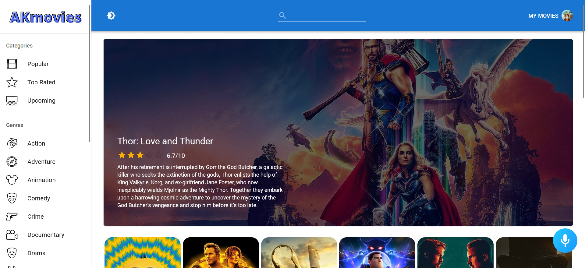
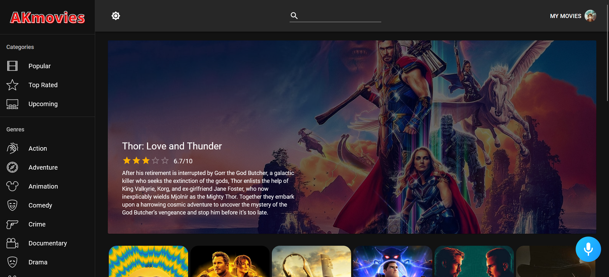

# AKmovies

#

AKmovies combines the desire to unleash powerful creativity with the industry's most advanced JavaScript tools including React.js, Redux, Material UI, Alan AI, and more.

This application includes user authentication, dark mode, sort movie on the basis of categories or genres, viewing movie and actor details, adding a movie to favorites or watchlist and many more functionalities. 

Alan works as in-app voice assistant which create conversational experiences for filmpire.

Website Link - https://akmovies.netlify.app

Developed by Ankit Kaushik! Enjoy! :D
